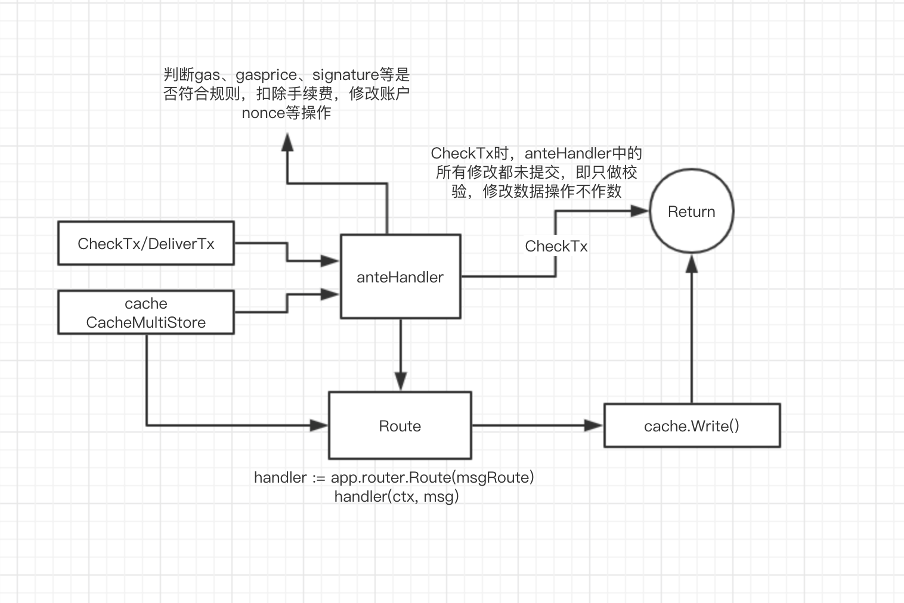

### Cosmos-anteHandler




```

// NewAnteHandler returns an AnteHandler that checks and increments sequence
// numbers, checks signatures & account numbers, and deducts fees from the first
// signer.
func NewAnteHandler(ak keeper.AccountKeeper, supplyKeeper types.SupplyKeeper, sigGasConsumer SignatureVerificationGasConsumer) sdk.AnteHandler {
	return sdk.ChainAnteDecorators(
		NewSetUpContextDecorator(), // outermost AnteDecorator. SetUpContext must be called first
		NewMempoolFeeDecorator(),
		NewValidateBasicDecorator(),
		NewValidateMemoDecorator(ak),
		NewConsumeGasForTxSizeDecorator(ak),
		NewSetPubKeyDecorator(ak), // SetPubKeyDecorator must be called before all signature verification decorators
		NewValidateSigCountDecorator(ak),
		NewDeductFeeDecorator(ak, supplyKeeper),
		NewSigGasConsumeDecorator(ak, sigGasConsumer),
		NewSigVerificationDecorator(ak),
		NewIncrementSequenceDecorator(ak), // innermost AnteDecorator
	)
}

```

`anteHandler`是流式处理的handler，作用在checkTx/DeliverTx

来看看主要负责些什么。

+ `NewSetUpContextDecorator`

  ```
  return ctx.WithGasMeter
  //设置后续使用的ctx
  ```

+ `NewMempoolFeeDecorator`

  检查fee中的gasPrice是否大于设置的最小gasprice

  ```
  minGasPrices := ctx.MinGasPrices()
  //requiredFees为minGasPrices的封装
  if !feeCoins.IsAnyGTE(requiredFees) {
  				return ctx, sdkerrors.Wrapf(sdkerrors.ErrInsufficientFee, "insufficient fees; got: %s required: %s", feeCoins, requiredFees)
  }
  ```

+ `NewValidateBasicDecorator`

  检查Tx的fee是不是都小于最大值、签名有没有之类的。

+ `NewValidateMemoDecorator`

  检查memo是否超过最大长度

+ `NewConsumeGasForTxSizeDecorator`

  根据TxBytes * per byte price计算gas

  `simulate`为`true`时，再加上验签的gas

+ `NewSetPubKeyDecorator`

  从签名中取出公钥，从Msg.GetSigners取出地址，验证公钥对应的地址是否与msg中地址相同，不同则报错。(用于验证如转账签名者必须是FromAddress)

  从签名中取出公钥地址，根据地址读取account，若没有account，报错。

  假如读出account的公钥未曾赋值，则赋值公钥并存储

+ `NewValidateSigCountDecorator`

  检查签名，如果公钥是多重签名的公钥，则检查多重的个数是否大于最大限制值

+ `NewDeductFeeDecorator`

  扣除fee，目前的版本是选择从sig签名数组里的第0个人的账户来扣除这笔手续费。

  ```
  func (tx StdTx) FeePayer() sdk.AccAddress {
  	if tx.GetSigners() != nil {
  		return tx.GetSigners()[0]
  	}
  	return sdk.AccAddress{}
  }
  ```

  另外，扣除的手续费是到module中去了

  ```
  err := supplyKeeper.SendCoinsFromAccountToModule(ctx, acc.GetAddress(), types.FeeCollectorName, fees)
  ```

+ `NewSigGasConsumeDecorator`

  计算验签时的gas

+ `NewSigVerificationDecorator`

  签名验证，使用tx中的Msg及fee和数据库里的account number及sequence进行封装签名用的消息

+ `NewIncrementSequenceDecorator`

  增加account的sequence


---

所以CheckTx是不修改任何状态的，直到出块后方才修改。那么，如果在出块前，同一个地址连发两笔交易，要通过CheckTx，那么sequence必须要一样，因为检查验签时使用的sequence是一样的(数据库中的sequence)，如果交易内容不同，hash不同的情况下，就能通过CheckTx，加入到交易池中，直到被打包进块，只是两笔交易必然有一笔会执行失败，成为`invalidTx`.


