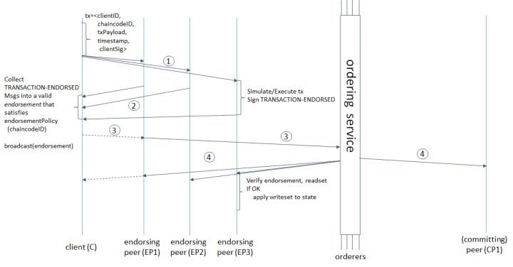

## Fabric基本认识


### 基本架构


[官方文档](http://hyperledger-fabric.readthedocs.io/en/master/arch-deep-dive.html)


上图为fabric的基本结构图，以下解释各名词含义。

- application: 提供各种语言的SDK接口
- membership： 也就是fabric-ca，提供成员服务，用来管理身份，提供授权和认证
- peer: 负责模拟交易和记账
  - Endorser(背书)，peer执行交易并返回yes/no
  - Committer，将验证过的区块追加到通道上各个账本的副本
  - Ledger，账本
  - chaincode，用来编写业务逻辑，交易指令用来修改资产，可以理解为fabric网络对外提供的一个交易接口（智能合约）
  - Event是fabric提供的一个事件框架，比如链代码事件，拒绝事件，注册事件等，在编写代码的时候可以订阅这些事件来实现自己的业务逻辑。
- o-service用来实现共识


区块链运行称之为链码（chaincode）的程序，保存状态、账本数据，并执行交易。链码是中央元素，因为交易是在链码上调用的操作。交易必须被“endorsed”，而且只有被“endorsed”后的交易才能被提交。管理方法和参数可能存在一个或多个特殊链码，统称为系统链码。

**交易**可能有两种类型：

- 部署事务，创建新的链接代码并将程序作为参数。当部署事务成功执行时，链代码已经安装在区块链上。
- 调用事务，在先前部署的链式代码的上下文中执行操作。一个invoke事务引用了一个chaincode和它提供的函数之一。成功时，chaincode执行指定的功能 - 可能涉及修改相应的状态并返回输出。

如后面所述，部署事务是调用事务的特例，其中创建新链代码的部署事务对应于系统链代码上的调用事务。

**State**，区块链的最新state被建模为版本化的键值存储（KVS），修改由运行在区块链上的链码（applications）调用KVS的put,get操作。详细的操作与版本化暂时略，看文档有点没看懂..State由peers进行维护，而不是orders和clients。KVS中的Keys可以从它们的名称中识别出属于特定的链码，因此只有特定链码的交易可以修改这个链码上的keys，但原则上，任何链码都可读别的链码的keys，即读取方便，但修改需特权。


**Ledger, 账本**，账本提供了发生在系统运行时的所有成功和不成功交易的历史。账本，作为总的区块总的哈希链（成功或不成功），由订阅服务构造。哈希链强制要求在账本中所有的有序区块以及每个块包含1个完全有序的交易，这在所有交易中强制要求所有的订阅。账本保存在所有的peer中，并可选择性的存放在orders中。在orders中，我们指的账本是OrdererLedger(总账)；在peers中，我们指的是PeerLedger（分账），分账和总账的区别在于peers本地会维护一个位掩码，这个位掩码会将有效的事务从无效的当中分离出来。peers可能会对分账进行修剪，orders负责维护总账的容错性和可用性并且可以随时修剪，前提是ordering服务的属性得到维护。账本允许peers重播所有交易的历史以及重建state,所以state是一个可选的数据结构。


**节点**，节点是区块链中的通信实体，节点只是一个逻辑功能，因为不同类型的多个节点可以在同一台物理服务器上运行，重要的是节点在“信任域”中如何分组并与控制它们的逻辑实体相关联。节点分为3种类型：

- Client 或 submitting-client: 提交真正交易给endorsers的客户，并且广播交易申请给ordering服务
- Peer：提交交易并维护state和账本的备份，除此之外，peers还有一个特殊的endorser角色
- Ordering-service-node或者order：通信服务 -> 实现传递保证，例如原子性或者所有的order广播


订阅服务提供了一个共享的通信通道给clients和peers, 提供的是一个包含交易信息的广播服务。client连接到通道，在通道中广播消息，消息将会送达给所有的peers。通道支持所有消息的原子性传递，即，消息通信是按序传递和可靠的。换句话说，通道给所有连接的peers输出的是相同消息，且是相同的逻辑顺序。这种原子性的通信保证在分布式系统中也被称为全序广播，原子广播，或者是共识。传递的消息是包含在区块链状态中的候选交易。


#### 交易流程

交易过程如下：

1. Application向一个或多个peer节点发送对交易的背书请求。
2. Peer的endorse执行背书，但并不将结果提交到本地账本，只是将结果返回给应用。
3. 应用收集所有背书节点的结果后，将结果广播给orderers，orderers执行共识，生成block，通过消息通道批量的将block发布给peer节点，更新lerdger。

交易过程可如下图




#### channel

channel是构建在Fabric网络上的私有区块链，实现了数据的隔离和保密。channel是由特定的peer所共享的，并且交易方必须通过该通道的正确验证才能与账本进行交互。

可以看到不同颜色的channel隔离了不同的peer之间的通信。


Fabric提供了一个first-network的<u>demo</u>来学习整个流程。要学哦! 入手做一个~等理论搞定，明天能不能搞定理论 fabric的~

今天理论到一半了吧.. 然而又读不下去了，真的超枯燥...我先搞一下别的。

first-network有两个组织，每个组织各有两个个peer节点，以及一个排序服务。两个peer节点无法达成共识，三个peer节点无法容错，四个peer节点刚好完成演示。


### fabric 理解

#### 问题记录

```
Policy for [Groups] /Channel/Application not satisfied: Failed to reach implicit threshold of 1 sub-policies, required [Admins]...
```

创建通道时，报错。

创建通道，根据通道定义的策略，传入相关成员签名/证书。如果策略是or1.admin和org2.admin，就需要两个一起授权(数组..)

首先检查是否是传入了相关用户，然后检查SigningIdentity是否正确，可打印出来对比`fmt.Println(string(identity.EnrollmentCertificate()))`

使用go-sdk的话会在tmp目录下有相关的数据目录，我的情况是先使用ca注册了一个admin..就会生成一个由ca签名的admin证书，但这个admin并不是org1.admin，所以我(⊙x⊙;)…删除了目录..  就还是不要注册admin这种敏感名字的用户了吧...


`peer chaincode instantiate -p git.wokoworks.com/blockchain/fabric-thread/multipeer/chaincode/go/test  -n mytest -v 0`

之后，在peer的`/var/hyperledger/production/chaincodes`目录下会有`mycc.0`的二进制？不晓得

?好奇怪  这个是要peer安装的意思？

安装和部署的区别


```
  cli:
    container_name: cli
    image: hyperledger/fabric-tools
    tty: true
    environment:
      - GOPATH=/opt/gopath
      - CORE_VM_ENDPOINT=unix:///host/var/run/docker.sock
      - FABRIC_LOGGING_SPEC=DEBUG
      - CORE_PEER_ID=cli
      - CORE_PEER_ADDRESS=peer:7051
      - CORE_PEER_LOCALMSPID=DEFAULT
      - CORE_PEER_MSPCONFIGPATH=/etc/hyperledger/msp
    working_dir: /opt/gopath/src/chaincodedev
#    command: /bin/bash -c './script.sh'
    volumes:
      - /var/run/:/host/var/run/
      - ./nodes/peer1/msp:/etc/hyperledger/msp
      - /Users/xiaoxuez/go/src/github.com/hyperledger/fabric/examples/chaincode/go:/opt/gopath/src/chaincodedev/chaincode
      - ./:/opt/gopath/src/chaincodedev/
    depends_on:
      - orderer
      - peer1
```


```
CORE_PEER_ADDRESS=peer1:7051 peer chaincode install -p chaincodedev/chaincode/sacc -n mycc -v 0
```


```
configure.sh "mychannel" "channel.tx anchor.tx" "peer1 peer2 peer3 peer4" false
```


------

#### 1. 生成公私钥和证书

```
cryptogen generate  --config ./crypto-config.yaml --output crypto-config
```

—output 为生成后的文件夹

crypto-config.yaml为

```
OrdererOrgs:
  - Name: Orderer
    Domain: orderer.net
    CA:
      Country: US
      Province: California
      Locality: San Francisco
    Specs:
      - Hostname: orderer

PeerOrgs:
  - Name: Org1
    Domain: org1.net
    CA:
      Country: US
      Province: California
      Locality: San Francisco
    Template:
      Count: 4
      Start: 1
    Users:
      Count: 1

```

有两个组织，为Orderer和Org1。使用命令后生成文件为

```
crypto-config
├── ordererOrganizations
│   └── orderer.net
│       ├── ca
│       ├── msp
│       ├── orderers
│       ├── tlsca
│       └── users
└── peerOrganizations
    └── org1.net
        ├── ca
        ├── msp
        ├── peers //count为4所以peers下面会有4个
        ├── tlsca
        └── users

```


关于证书，稍微说明一下看到的源码。

首先，是两个组织，从cryptogen的角度上来讲，这两个组织的一切证书和公私钥生成方式是一样的。只是名字什么的是由配置文件决定的。

其次，一组证书和公私钥的生成方式呢，分为几个步骤

1. 生成公私钥，由私钥对包含公钥的等信息进行签名可得证书。
2. 一个组织的证书链，包含一个root ca，可其签发的一系列证书。首先，会产生一对公私钥，这个私钥会作为root ca的私钥，config中定义的ca的其他属性会作为root ca的元数据(签名时应该会用到)，然后就会生成一个私钥文件，和一个root ca的证书(证书链中的顶级证书)，这两个文件位于ca文件夹。
3. 另外，因为fabric中需要两套证书，另外一套为tls，用于通信传输.. 所以会生成两套(生成逻辑是一毛一样的)，一套位于ca文件夹，一套位于tlsca文件夹。
4. msp文件夹内的内容主要是ca和tlsca中的证书的拷贝(不包含私钥)，另外是有一个admin的用户证书(拷贝自用户目录)
5. users目录和peers目录中，每个peer和user的逻辑都是生成了一对公私钥，随后，使用root ca和tlsca对公钥d等信息进行签名颁发证书，同样也包含两套证书，同时，还包括root ca和tlsca的自带证书

关于证书验证的问题，启动ca服务端时会将root ca作为其签发证书的私钥，当用户注册并申请证书后获得证书，其实ca server返回的x509格式的证书申请结果中是含有证书和签发者的公钥信息的，但在fabric-sdk-go的使用中，enroll的结果返回只有证书，在封装的内层代码中将签发者的公钥信息直接忽略了。当用户拿到证书，进行交易发送到peer，peer如何验证证书呢.. peer目前只有两个签发者，一个是自己，一个是root ca(具有root ca的证书，所以就可以使用公钥验证)，所以应该是使用这两者进行验证吧。但是，再想想，其实正常的情况，构成了证书链的话，如果a -> b -> c的证书链的话，应该是用户提交的证书中，就会包含整个证书链，以后待考证？


#### 2. 生成初始块和配置的交易

```
configtxgen -profile SampleOrg -outputBlock ./channel-artifacts/genesis.block
```

这个命令会自动加载当前文件夹下的`configtx.yaml`配置文件，该文件配置了哪些


```
CORE_PEER_ADDRESS=peer1:7051 peer chaincode install -p chaincodedev/chaincode/sacc -n mycc -v 0
//-p  Path to chaincode,
//  	默认路径是从gopath下进行搜索，即上例中的路径为gopath/chaincodedev/chaincode/sacc, sacc为文件夹名称，只配置到文件夹即可
//-n, --name string                    Name of the chaincode
```


```
peer chaincode instantiate -o orderer.example.com:7050 --tls $CORE_PEER_TLS_ENABLED --cafile /opt/gopath/src/github.com/hyperledger/fabric/peer/crypto/ordererOrganizations/example.com/orderers/orderer.example.com/msp/tlscacerts/tlsca.example.com-cert.pem -C $CHANNEL_NAME -n mycc -v 1.0 -c '{"Args":["init","a", "100", "b","200"]}' -P "OR ('Org1MSP.admin','Org1MSP.member')"
```


```
peer chaincode instantiate -o orderer.example.com:7050  --tls true --cafile  /opt/gopath/src/github.com/hyperledger/fabric/peer/crypto/ordererOrganizations/example.com/orderers/orderer.example.com/msp/tlscacerts/tlsca.example.com-cert.pem -C mychannel -n marbles02 -v 0 -c '{"Args":[""]}' -P "OR ('Org1MSP.admin','Org1MSP.member')"
//没有配tsl的话就不虚要--tls true --cafile  -o也有默认值orderer.example.com:7050  -P默认值？
```


大概看了下，没怎么看透。基本的说一下，在configtx.yaml中，定义了初始组织的基本信息。其中Profiles提供了一些组合，这些组合可以提供生成genesis块(包含order信息组织和财团(Consortiums = =应该就是权限最大的组织))，可以生成新建channel的交易(包含一个Consortium和Application定义)。

首先，会使用configtx.yaml生成创世块，OneOrgOrdererGenesis为Profiles中的定义的组合段落。

```
configtxgen -profile OneOrgOrdererGenesis -outputBlock ./config/genesis.block
```


其次，生成相应的通道，同理OneOrgChannel也是Profiles中的定义的组合段落。

```
configtxgen -profile  OneOrgChannel -outputCreateChannelTx ./config/channel.tx -channelID $CHANNEL_NAME
```


要新建通道的话，就要先使用上述生成通道的命令生成一个.tx的文件，然后再调用新建通道的命令传入这个文件。


### go-sdk

#### config.yaml

初始化sdk的时候需要传入config.yaml，所以这个配置文件是最关键的。

在这个文件中，主要包含几个大块。

- client，客户端配置，即对自己的一些配置，包括自己所属组织，自己的msp文件(keys和certs)。BCCSP定义了加密的相关算法，还有就是tls证书配置
- channel, 配置通道，即当访问某通道时通过哪些peer(peer_name)，以及这个peer具有的权限，还有就是性能相关的配置。程序要访问不同的通道，这个就需要有相应的配置项。不然就会报` could not get chConfig reference`
- organizations,配置网络中的参与者(org -> peer_name 和 orderorg)
- orderers, 配置orderer的name和相关rpc的配置，tls配置
- peers，配置peers的name和相关rpc的配置，tls配置
- certificateAuthorities， 配置ca的name和相关rpc的配置，tls配置
- entityMatchers，这个是匹配替换，用于集中替换，可匹配正则的name，满足的实体(peer、orderer、ca)都会进行相应的替换，可用于替换url..

#### 源码分析

- fabsdk.New(config)

  - defPkgSuite，包管理工具，根据config提供相应的包，defaultPkgSuite提供的每个包都是工厂模式，根据config可提供对应的具体的包。
    - Core(corefactory)，提供了BCCSP、signing manager和fabric primitives的实现包。
      - BCCSP即区块链加密服务提供者，提供加密标准和算法的实现。目前支持两种实现，sw和pkcs11。
        - sw即software-based，基于软件实现的BCCSP，通过调用go原生支持的密码算法实现，并提供keystore来保存密钥
        - pkcs11，通过调用pkcs11接口实现相关加密操作，仅支持ecdsa、rsa以及aes算法，密码保存在pkcs11通过pin口令保护的数据库或者硬件设备中。
    - MSP，成员管理提供实现，如本地成员管理(从配置文件读入用户..本地存储用户等)，主要实现位于msppvdr包下。
    - Service，服务提供实现，如channel服务、discovery服务等..
    - Logger

  所以，其实fabsdk.new就是提供了一大堆的provide。

  ```
  //update sdk providers list since all required providers are initialized
  	sdk.provider = context.NewProvider(context.WithCryptoSuiteConfig(cfg.cryptoSuiteConfig),
  		context.WithEndpointConfig(cfg.endpointConfig),
  		context.WithIdentityConfig(cfg.identityConfig),
  		context.WithCryptoSuite(sdk.cryptoSuite),
  		context.WithSigningManager(signingManager),
  		context.WithUserStore(userStore),
  		context.WithLocalDiscoveryProvider(localDiscoveryProvider),
  		context.WithIdentityManagerProvider(identityManagerProvider),
  		context.WithInfraProvider(infraProvider),
  		context.WithChannelProvider(channelProvider),
  		context.WithClientMetrics(sdk.clientMetrics),
  	)
  	...
  ```


总的来说，go-sdk是封装的rpc。所以有了sdk的相关上下文，就可以进行实例化相关的rpc client了。在pkg包下的client里，目录如下

```
├── channel   //通道相关的rpc
├── common
├── event	//事件监听，如区块、链码、或交易状态
├── ledger	//账本相关rpc,如查询区块、交易等
├── msp		//成员相关rpc,与ca交互，提供注册查询等api
└── resmgmt	//resouce manager clinet
```


#### msp

msp包提供了与ca相关的rpc调用，如注册等。同时也提供了查询本地identify功能，即访问本地文件，查询出具体的私钥和相关证书(msppvdr包)。

rpc相关调用包括以下功能

```
1. 身份注册；
2. 颁发登录证书(ECerts)；
3. 颁发交易证书(TCerts)，保证链上交易的匿名性与不可连接性；
4. 证书续期与撤销
```

首先，只有已经登录了的身份才能发起注册的请求，而且必须有相应的权限来注册想要注册的身份类型。所以要注册用户，首先要使用一个已有的身份，然后再进行注册新用户和密码。

- Enroll方法，内容包括，生成新的私钥(存于config.credentialStore.cryptoStore/)，然后将公钥等信息作为参数，进行http请求ca服务器，ca服务器将返回对公钥等信息进行签名完的证书(存于config.credentialStore.path/)。
  - 提到这里，多嘴一句，证书的存储文件名为name@Org1MSP-cert.pem，在进行查询时，可使用name或Org1MSP皆可查询到证书，然后通过对证书进行解析出公钥pubKey，name和pubKey.SKI()组成了私钥的文件名，从而可索引到私钥。

​        总的来说就是一次Enroll，就会更新一次私钥和证书。

- Register方法，进行注册，上文提到，要注册，首先要登录一个已有的身份(用户名)，获取证书，然后再使用证书进行注册别的身份。

  - 注册时可传属性，如

    ```
    attributes:
            - name: hf.Revoker
            value: true
            ECert: true
            - name: anotherAttrName
            value: anotherAttrValue
    ```

    这个应该是跟LDAP…相关的吧..暂时不知道是啥


#### channel

通道相关api，如链码的调用。

这里先对链码的调用简单分析一下。

channel的客户端提供了两个方法`Query`和`Execute`

先说二者的共同流程。两个方法都是负责组装参数(handlers…opts..)后调用`chclinet.InvokeHandler`。在`InvokeHandler`里可以看到流程是准备参数，准备上下文，然后启动一个协程运行handlers，本方法堵塞直到complete或reqCtx.Done()通道读出消息，当handlers运行完毕后会向通道complete写入消息(成功或失败都会写入)，reqCtx.Done()则是超时。所以重点是运行Handler。Handler的组装类似于生产线，如a -> b ->c按顺序执行，且将上一个执行的结果也传递给下一位。

- Query

  - ProposalProcessorHandler

    首先，检查targets参数长度是否为0，targets为进行背书的节点们。如果没有提供targets，将会查询背书的节点，opts参数中的filter将会在这里使用到，就是按需求筛选节点(如是查询还是背书...)

  - EndorsementHandler

    其次，会将proposal发送到各个targets，返回的responses会传递下去

  - EndorsementValidationHandler

    再次，验证各个target返回的结果，状态码是否正常，reponse是否一样

  - SignatureValidationHandler

    最后，验证各个节点返回的response的签名/证书是否正确

  到此为止，query请求就完成了，最后将reponse返回给上层

- Execute

  - SelectAndEndorseHandler

    首先检查targets，其次调用EndorsementHandler发送proposal，然后根据链码策略向另外的peer发起proposal，返回的responses一起传递下去

  - EndorsementValidationHandler

    同上

  - SignatureValidationHandler

    同上

  - CommitHandler

    拿到所有peer的背书后，首先向order发送交易。然后订阅这笔交易状态，接收到新状态，方法执行结束，继续向下执行

response结构体中包含有Payload，ChaincodeStatus，TxValidationCode。

在github.com/hyperledger/fabric/protos/peer下有TxValidationCode的所有码，可判断如下

```
switch pb.TxValidationCode(response.TxValidationCode) {
	case pb.TxValidationCode_VALID:
		cliconfig.Config().Logger().Debugf("(%s) - Successfully committed transaction [%s] ...\n", t.id, response.TransactionID)
		return nil
	case pb.TxValidationCode_DUPLICATE_TXID, pb.TxValidationCode_MVCC_READ_CONFLICT, pb.TxValidationCode_PHANTOM_READ_CONFLICT:
		cliconfig.Config().Logger().Debugf("(%s) - Transaction commit failed for [%s] with code [%s]. This is most likely a transient error.\n", t.id, response.TransactionID, response.TxValidationCode)
		return invokeerror.Wrapf(invokeerror.TransientError, errors.New("Duplicate TxID"), "invoke Error received from eventhub for TxID [%s]. Code: %s", response.TransactionID, response.TxValidationCode)
	default:
		cliconfig.Config().Logger().Debugf("(%s) - Transaction commit failed for [%s] with code [%s].\n", t.id, response.TransactionID, response.TxValidationCode)
		return invokeerror.Wrapf(invokeerror.PersistentError, errors.New("error"), "invoke Error received from eventhub for TxID [%s]. Code: %s", response.TransactionID, response.TxValidationCode)
	}
```

#### sdk example

[Sdk example ](https://github.com/securekey/fabric-examples/tree/master/fabric-cli)


## couchdb

#### 查询索引

```
http://localhost:5984/mychannel_mycc/_index
```

查询结果如

```
{
    "total_rows":2,
    "indexes":[
        {
            "ddoc":null,
            "name":"_all_docs",
            "type":"special",
            "def":{
                "fields":[
                    {
                        "_id":"asc"
                    }
                ]
            }
        },
        {
            "ddoc":"_design/indexOwnerDoc",
            "name":"indexOwner",
            "type":"json",
            "def":{
                "fields":[
                    {
                        "docType":"asc"
                    },
                    {
                        "owner":"asc"
                    }
                ]
            }
        }
    ]
}
```


这个是在我刚启动好链码容器时，什么操作都没做。为什么会建了一个索引呢.

另外，在这个文档下，发现存在一条记录(一打开就有一条记录)。

```
{
    "_id":"_design/indexOwnerDoc",
    "_rev":"1-56c3e9386cb19531f6731afa88281caa",
    "language":"query",
    "views":{
        "indexOwner":{
            "map":{
                "fields":{
                    "docType":"asc",
                    "owner":"asc"
                },
                "partial_filter_selector":{

                }
            },
            "reduce":"_count",
            "options":{
                "def":{
                    "fields":[
                        "docType",
                        "owner"
                    ]
                }
            }
        }
    }
}
```


猜测，索引应该是由这条记录引起的，似乎是创建时的自动的索引？不对！是在我的链码里，有个文件夹叫META-INF下定义的。

果然，这下面有个json文件，内容为

```
{
	"index":{"fields":["docType","owner"]},
	"ddoc":"indexOwnerDoc",
	"name":"indexOwner",
	"type":"json"
}
```

完全吻合。所以定义索引是可以通过这个配置文件！

定义的索引对于查询的意义，似乎是如果要查询相应的字段(字段相关，如大于啥小于啥)，就要定义包含其中的字段的索引

默认情况下，会建立一个id的索引。

```
{
 "type": "special",
 "def": {
  "fields": [
   {
    "_id": "asc"
   }
  ]
 }
}
```


如新建一个索引视图

```
curl -i -X POST -H "Content-Type: application/json" -d "{\"index\":{\"fields\":[\"size\",\"docType\",\"owner\"]},\"ddoc\":\"indexSizeSortDoc1\", \"name\":\"indexSizeSortDesc1\",\"type\":\"json\"}" http://localhost:5984/mychannel_mycc/_index
```


重新查询索引，多了一个

```
{
    "total_rows":3,
    "indexes":[
        {
         ...
        },
        {
         ...
        },
        {
            "ddoc":"_design/indexSizeSortDoc",
            "name":"indexSizeSortDesc",
            "type":"json",
            "def":{
                "fields":[
                    {
                        "size":"desc"
                    },
                    {
                        "docType":"desc"
                    },
                    {
                        "owner":"desc"
                    }
                ]
            }
        }
    ]
}
```

建立了这个索引后，就可以进行size相关的查询，如

```
"{\"selector\":{\"docType\":{\"$eq\":\"marble\"},\"owner\":{\"$eq\":\"tom\"},\"size\":{\"$gt\":0}},\"fields\":[\"docType\",\"owner\",\"size\"],\"sort\":[{\"size\":\"desc\"}],\"use_index\":\"_design/indexSizeSortDoc\"}"
```

**啊！！**就是建立的这个索引视图是包括size、docType、owner这三个的，然后我使用查询的时候，如果少传一个，就是我只查询docType和size，就会报错`Error running query. Reason: (no_usable_index) No index exists for this sort, try indexing by the sort fields.`

几经挣扎和尝试，确定下来几个结论。

1. 如果不适用sort，selector中的field都随意查询，使用的默认index(id asc排序)
2. 如果使用了sort，那么需要一个index包含 在selector中的field + sort中的field组成的field ，并且index中定义的field集合必须是selector中的field + sort中的field组成的field的子集，即index中出现过的，在查询时一定要出现，在selector和在sort中都无所谓，但sort中的一定要出现在index中
